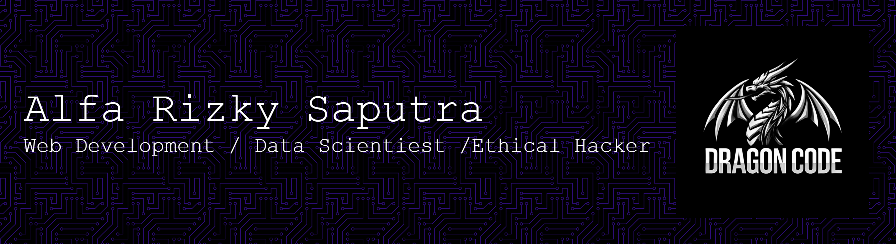

Last login: Sun Feb 15 08:30:00 2026 from 127.0.0.1

## Welcome to Dragon Code's Repository



<h1 align="center">About Alfa Rizky Saputra </h1>
<h3 align="center">Founder Dragon Code</h3>

<p align="justify">Saya adalah seorang karyawan pabrik sekaligus mahasiswa S1 Sistem Informasi, yang sedang menempuh perjalanan panjang di dunia teknologi. Di luar rutinitas harian, saya membangun mimpi besar melalui Dragon Code ,
 Sebuah identitas yang mencerminkan semangat, disiplin, dan konsistensi saya di dunia IT.
Saat ini, saya fokus pada bidang: Website Development, Data Science, dan Ethical Hacking.
Saya adalah pribadi yang haus akan ilmu dan percaya bahwa belajar adalah proses yang tak pernah berakhir. Setiap hari, saya mengasah kemampuan, menulis baris demi baris kode, menganalisis data, dan memperdalam pemahaman tentang keamanan sistem. Bagi saya, coding bukan sekadar keterampilan melainkan bagian dari hidup dan cara saya berkembang.
Tujuan saya jelas: menjadi seorang Ethical Hacker profesional yang menguasai dunia web dan data, serta mampu memberikan kontribusi nyata dalam keamanan dan teknologi.
Saya sangat terbuka untuk kolaborasi, diskusi, dan belajar bersama. Jika Anda memiliki visi yang sama dalam dunia teknologi, mari kita bertumbuh dan berkembang bersama.
</p>

```
Mission: Clean the web from gambling malware.
Status: Root Access Secured.
```

<table width="100%">
  <tr>
    <td>
      <i>"Build with Logic, Secure with Integrity."</i>
    </td>
    <td align="right">
      
    </td>
  </tr>
</table>

DragonCode098@terminal:~$ \_ <br/>

<a href="https://git.io/typing-svg"></a>
<br/>


## ```My Skills tools and technologies```<br/>

> Tools and technologies that I have worked with and am interested in

<table align="center">

  <tr>
    <td align="center" width="96">
        
        <br>HTML
    </td>
    <td align="center" width="96">
        
        <br>JavaScript
    </td>
    <td align="center" width="96">
        
        <br>ReactJS
    </td>
    <td align="center" width="96">
        
        <br>Python
    </td>
    <td align="center" width="96">
        
        <br>MySQL
    </td>
    <td align="center" width="96">
        
        <br>PHP
    </td>
    <td align="center" width="96">
        
        <br>KaliLinux
    </td>
  </tr>

  <tr>
    <td align="center" width="96">
        
        <br>CSS
    </td>
    <td align="center" width="96">
        
        <br>Figma
    </td>
    <td align="center" width="96">
        
        <br>Git
    </td>
    <td align="center" width="96">
        
        <br>GitHub
    </td>
    <td align="center" width="96">
        
        <br>Java
    </td>
    <td align="center" width="96">
        
        <br>Golang
    </td>
    <td align="center" width="96">
        
        <br>Linux
    </td>
  </tr>

</table>

## ```Do you really need help or collaboration?``` <br/>
```Don't be shy, please contact me through social media.```
<a href="https://wa.me/6285155148830">

<a href="https://www.instagram.com/alfamilenials">

<a href="https://www.linkedin.com/in/alfa-rizky-saputra-954094326/">

<a href="">


## ```If you are tired, there are games below that you can play.```

<picture>
  <source media="(prefers-color-scheme: dark)" srcset="https://raw.githubusercontent.com/DragonCode098/DragonCode098/output/pacman-contribution-graph-dark.svg">
  <source media="(prefers-color-scheme: light)" srcset="https://raw.githubusercontent.com/DragonCode098/DragonCode098/output/pacman-contribution-graph.svg">
  
</picture>
