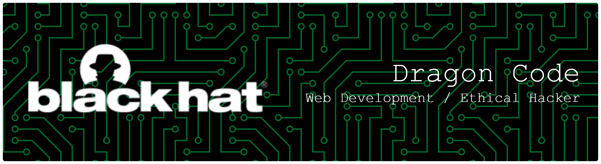

Last login: Sun Feb 15 08:30:00 2026 from 127.0.0.1

## Welcome to Dragon Code's Repository



```
Mission: Clean the web from gambling malware.
Status: Root Access Secured.
```

> _"Menghapus jejak digital yang merusak, satu baris kode di setiap waktu."_
---

DragonCode098@terminal:~$ \_
<br/>


<div align="center">
  
</div>


```My Skill```<br/>
[](https://skillicons.dev)

```GitHub Stats```<br/>


```Top Contributed Repo```<br/>


<picture>
  <source media="(prefers-color-scheme: dark)" srcset="https://raw.githubusercontent.com/DragonCode098/DragonCode098/output/pacman-contribution-graph-dark.svg">
  <source media="(prefers-color-scheme: light)" srcset="https://raw.githubusercontent.com/DragonCode098/DragonCode098/output/pacman-contribution-graph.svg">
  
</picture>
<!-- Proudly created with GPRM ( https://gprm.itsvg.in ) -->
<!--
**DragonCode098/DragonCode098** is a ✨ _special_ ✨ repository because its `README.md` (this file) appears on your GitHub profile.

Here are some ideas to get you started:

- 🔭 I’m currently working on ...
- 🌱 I’m currently learning ...
- 👯 I’m looking to collaborate on ...
- 🤔 I’m looking for help with ...
- 💬 Ask me about ...
- 📫 How to reach me: ...
- 😄 Pronouns: ...
- ⚡ Fun fact: ...
-->
